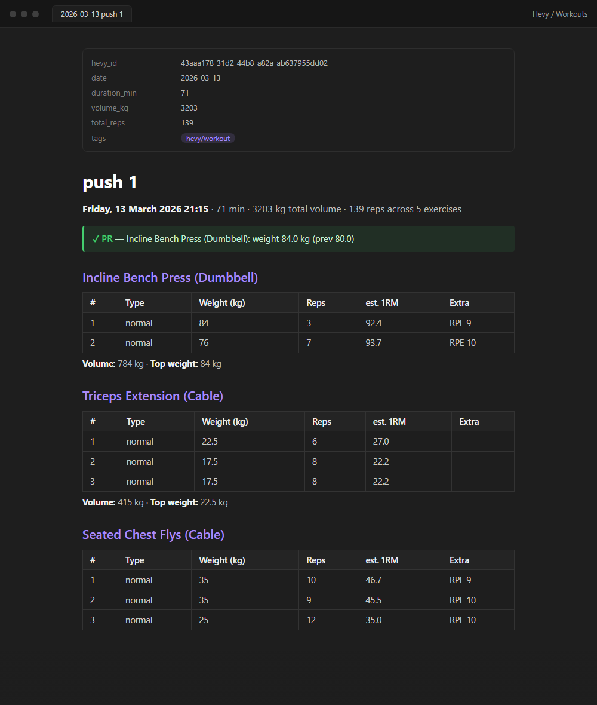
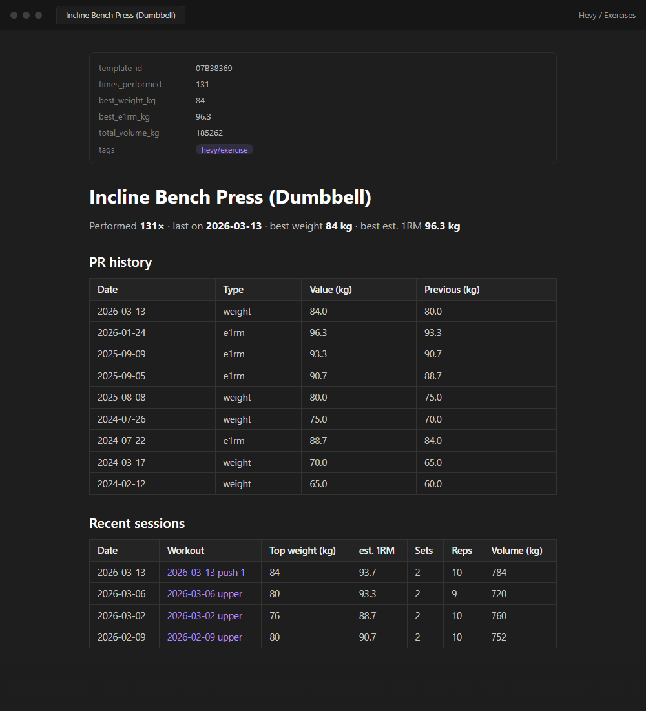
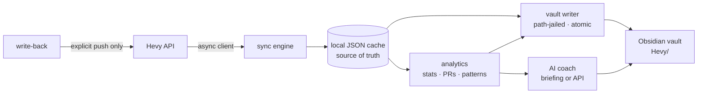

# Hevy Second Brain (`hevy-brain`)

[](https://github.com/samrathsingh302/hevy-brain/actions/workflows/lint.yml)
[](https://github.com/samrathsingh302/hevy-brain/actions/workflows/test.yml)


A Python CLI that syncs your complete [Hevy](https://www.hevy.com/) workout
history into an **Obsidian second brain**, analyses your training patterns,
generates AI coaching grounded in your real numbers, and pushes changes back
to Hevy — so you rarely have to edit the Hevy app by hand.

Running against a real account: **285 workouts · 124 exercises · 2+ years of
training history**, generated and kept in sync as the notes below.

| Workout note (auto-generated) | Exercise note (evergreen) |
| --- | --- |
|  |  |

## What it does

- **Full sync** — backfills your entire workout history once, then pulls only
  changes via Hevy's `/workouts/events` endpoint (new, edited, and deleted
  workouts) on every run. Body measurements are replaced wholesale on each
  sync and deduplicated by date.
- **Obsidian notes** — one note per workout (set-by-set tables, PR callouts),
  one evergreen note per exercise (PR history, est. 1RM), a dashboard, body
  measurement log, and weekly / monthly / yearly reviews (each year-in-review
  has totals, best month, top lifts, PRs, and a monthly-volume chart). All with
  frontmatter for Dataview/Bases and wikilinks between everything.
- **Progress charts** — a weekly-volume trend on the dashboard and an est. 1RM
  trend per exercise, rendered as native Mermaid charts (zero dependencies).
  Toggle/tune via the `[charts]` config block.
- **Analytics** — volume per muscle group, push/pull balance, streaks,
  plateau detection (stalled est. 1RM), and week-over-week overload tracking.
- **AI coach (free by default)** — `hevy-brain coach` writes a self-contained
  *briefing* note (your computed stats + the coaching instructions). Open it
  in Claude Code or claude.ai under your existing subscription — **no API key,
  no per-call cost.** An opt-in `--api` flag uses the metered Anthropic API
  for full automation instead. Either way, every claim cites your actual
  numbers and exercise swaps are restricted to exercises that exist in Hevy.
  Each briefing also carries a **"since your last briefing"** recap — an
  honest, objective read of how the plateaus, consistency, and balance it
  flagged last time have actually moved (it grades the data, never the advice).
- **Write-back** — log body measurements, create workouts, edit routines, and
  fix logged workouts (typo'd weight, forgotten set) in Hevy — all from the
  CLI / their notes, with a diff preview before any change is sent. Writes are
  **always manual**; only reads are automated.

## Architecture



`api/` (aiohttp Hevy client) → `sync.py` (full backfill + incremental events
cursor) → `store/` (local JSON cache — the vault can be rebuilt offline from
it) → `analytics/` + `vault/` (note generation) and `coach/`. Write-back
lives in `writeback/` and is only reachable from explicit CLI commands.

### Engineering notes

- **Idempotent by design** — syncing or regenerating twice produces zero
  diffs; notes are keyed by Hevy workout ID in frontmatter.
- **Safe vault writes** — the writer is path-jailed to its own subfolder
  (path-traversal guarded), every write is atomic (temp file + rename), and
  anything you write below the `%% hevy-brain:end %%` marker in any note
  survives regeneration. Deleted workouts are archived, never destroyed.
- **Crash-safe sync cursor** — the events cursor and sync metadata roll back
  if a sync fails before the cache is persisted, so a retry replays the same
  events instead of silently skipping them (regression-tested).
- **Offline test suite** — 60 pytest tests, no network, the real account is
  never touched by tests; ruff lint + format enforced in CI.
- **Secrets stay out of files** — API keys come from environment variables
  only; personal workout data and config never leave the machine (gitignored).

## Quick start

```powershell
git clone https://github.com/samrathsingh302/hevy-brain
cd hevy-brain
pip install -e .
```

Set your API keys (user-level env vars so scheduled tasks see them):

```powershell
[Environment]::SetEnvironmentVariable('HEVY_API_KEY', '<key from hevy.com/settings?developer>', 'User')
[Environment]::SetEnvironmentVariable('ANTHROPIC_API_KEY', '<key>', 'User')   # only for `coach --api`
```

Point it at your vault (optional — without a config it writes to a local
`vault_staging/` folder so you can try it safely):

```powershell
copy config.example.toml config.toml
# then edit config.toml:
```

```toml
[vault]
path = 'C:\path\to\your\vault'   # the folder containing .obsidian
subfolder = "Hevy"   # a separate folder; hevy-brain never touches anything else
```

## Use

```text
hevy-brain sync     # fetch new/changed Hevy data into the local cache
hevy-brain vault    # regenerate all Obsidian notes from the cache
hevy-brain full     # sync + vault
hevy-brain coach    # FREE briefing note - analyse it with your Claude sub
hevy-brain coach --api   # opt-in: metered Anthropic API (needs ANTHROPIC_API_KEY)
hevy-brain guide return  # comeback protocol after a lapse: baselines, briefing,
                         # and Return Week 1 routine drafts at reduced loads
hevy-brain ask "How do I get my bench moving again?"
                    # one question, answered from your data + cited claims
hevy-brain status   # cache overview
hevy-brain push measurement --weight-kg 78.4 [--fat-percent 17] [--date 2026-06-10]
hevy-brain push workout path\to\plan.md                # create from a planned note
hevy-brain push workout path\to\draft.md --update [--dry-run]  # fix a logged one
hevy-brain push routine path\to\draft.md [--dry-run]   # PUT, with diff preview
```

Reads are automatic; **writes to Hevy only happen on explicit `push` commands.**

### Vault layout

```
Hevy/
├── Dashboard.md                     # totals, streaks, muscle balance, recent PRs
├── Workouts/2026-06-08 Push Day.md  # per-workout: tables, PR callouts, links
├── Exercises/Bench Press (Barbell).md  # per-exercise: PR history, est. 1RM
├── Measurements/Body Log.md
├── Reviews/2026-W24 Weekly Review.md   # + monthly reviews
├── Coach/2026-06-10 Recommendations.md
└── Archive/                         # notes for workouts deleted in Hevy
```

Anything you write **below** the `%% hevy-brain:end %%` marker in any note is
preserved forever — treat the area above it as generated.

### Planned-workout notes (push to Hevy)

```markdown
---
type: hevy-planned-workout
title: Coach Push Day
start_time: 2026-06-12T17:00:00+00:00
end_time: 2026-06-12T18:00:00+00:00
exercises:
  - name: Bench Press (Barbell)
    exercise_template_id: 79D0BB3A
    sets:
      - { weight_kg: 60, reps: 8 }
      - { weight_kg: 60, reps: 8 }
---
```

Then: `hevy-brain push workout plan.md`. Template IDs are in each exercise
note's frontmatter (synced from Hevy).

## Automate (Windows)

```powershell
powershell -ExecutionPolicy Bypass -File scripts\register_task.ps1
```

Registers two Task Scheduler jobs: `hevy-brain full` hourly and
`hevy-brain coach` Sundays at 19:00, logging to `logs/`.

## Development

```powershell
pip install -e ".[dev]"
python -m pytest tests -q     # 60 tests, no network, no real API calls
python -m ruff check hevy_brain tests
python -m ruff format hevy_brain tests
```

## Provenance

The Hevy API client and event-sync approach were originally ported from the
excellent [hudsonbrendon/HA-hevy](https://github.com/hudsonbrendon/HA-hevy)
Home Assistant integration; this repo then retired the integration and grew
into a standalone tool (cache, analytics, vault generation, coach, and
write-back are new).

## License

MIT — see [LICENSE](LICENSE).
